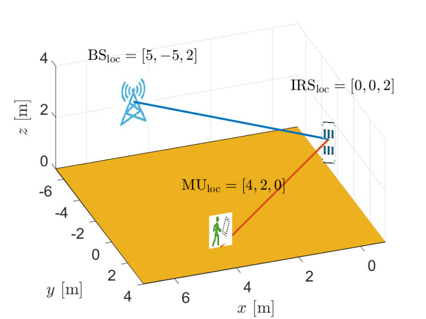
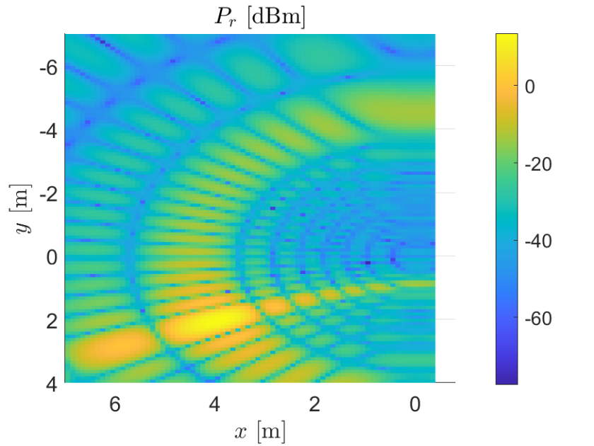

# Localization Methods in IRS-assisted links
This repository contains Matlab code that implements a localization method supported by an Intelligent Reflective Surface (IRS) device.

## Description
This work studies the localization capabilities of **Intelligent Reflective Surface (IRS)-assisted links** in a **multiple mobile user (MU)** scenario, see Fig. 1.
Localization is performed by scanning a target area and measuring the **received power at the base station (BS)** while configuring the IRS beam to point at candidate locations in the ground plane. 
The MU position is estimated by locating the **peak of the received power surface**, see reference in [1].

<figure>
  

    
  

</figure>

Fig. 1: IRS-assisted localization scenario: BS scans the x-y plane by steering the IRS beam and records received power.

### Conceptual workflow
- **Area scanning:** The BS configures the IRS to point to each grid location (block) in the x-y plane and records received power. 
- **Peak-based estimate:** The MU location is estimated as the grid coordinate with the maximum received power, see the results of power measurements in Fig. 2.

<figure>
  

    
  

</figure>

Fig. 2: Example received power surface; MU position is inferred from the power peak.

## Installation
This code is tested in MATLAB 25.1, and the required toolboxes are listed in the table below.

| Matlab Toolbox  | Version |
| ------------- | ------------- |
| Antenna Toolbox | 25.1  |

## Usage

This code runs directly from the file `A_Master.mlx`.
This file calls to the code to evaluate the received power at the BS and plot the corresponding figures.
This file calls to the following ones
1. `Parameters.mlx`: Configure simulation parameters (grid size, MU locations, IRS/BS placement, etc.
2. `visualizing_scenario.mlx`: This file is located within the folder [functions_visualization/](https://github.com/jorge-torresgomez/IRS_localization/tree/main/functions_visualization).
The code in this file plots the scenario illustrated in Fig. 1.
3. `visualizing_reflection_coeff_IRS.mlx`: This file is located within the folder [functions_visualization/](https://github.com/jorge-torresgomez/IRS_localization/tree/main/functions_visualization).
The code in this file depicts a 3D plot of the reflection coefficient of the IRS elements.
4. `IRS_5G_1MU.mlx`: This code evaluates the received power at the BS, extracts the peak coordinates, and compute localization error.
5. `visualizing_fingerprint.mlx`: This code depicts the received power at the BS, as illustrated in Fig. 2.

## Repository Structure

- 📁 **[arxiv/](https://github.com/jorge-torresgomez/IRS_localization/tree/main/arxiv)**  
  Matlab source code for additional features, including the detection of multiple users.

- 📁 **[functions_visualization/](./https://github.com/jorge-torresgomez/IRS_localization/tree/main/functions_visualization)**  
  Exported figures (system model, power surfaces).

- 📁 **[icons/](./https://github.com/jorge-torresgomez/IRS_localization/tree/main/icons)**  
  Includes icons to represent a BS, MU, and the IRS, which is used for plotting the scenario in Fig. 1.

- 📁 **[data/](./data)**  
  Generated datasets (power maps, MU layouts, results).

## Features
- **RSS-based localization via IRS scanning:** Estimate MU location by maximizing received power over a grid.
- **Multi-user interference analysis:** evaluate how localization error changes with additional interfering MUs.
- **Impairment-aware leakage model:** include a leakage factor to represent non-ideal RF front-end effects.

## Contributing
If you want to contribute improvements (more channel models, mobility patterns, faster peak-search, etc.), feel free to contact us following the contact information below.

## License

## Acknowledgements
This work acknowledges support by the Federal Ministry of Education and Research (BMBF, Germany) within the 6G Research and Innovation Cluster 6G-RIC under Grant 16KISK020K.

## References
[1] Jorge Torres Gómez and Falko Dressler, **"Assessing the Interplay between Localization Accuracy and Interference in IRS-assisted Links,"** Proceedings of IEEE ANDESCON 2024, Cusco, Peru, September 2024,  [`DOI`](https://ieeexplore.ieee.org/document/10755676).

## Contact Information
- **Name:** Jorge Torres Gómez  
    
    
    
  

